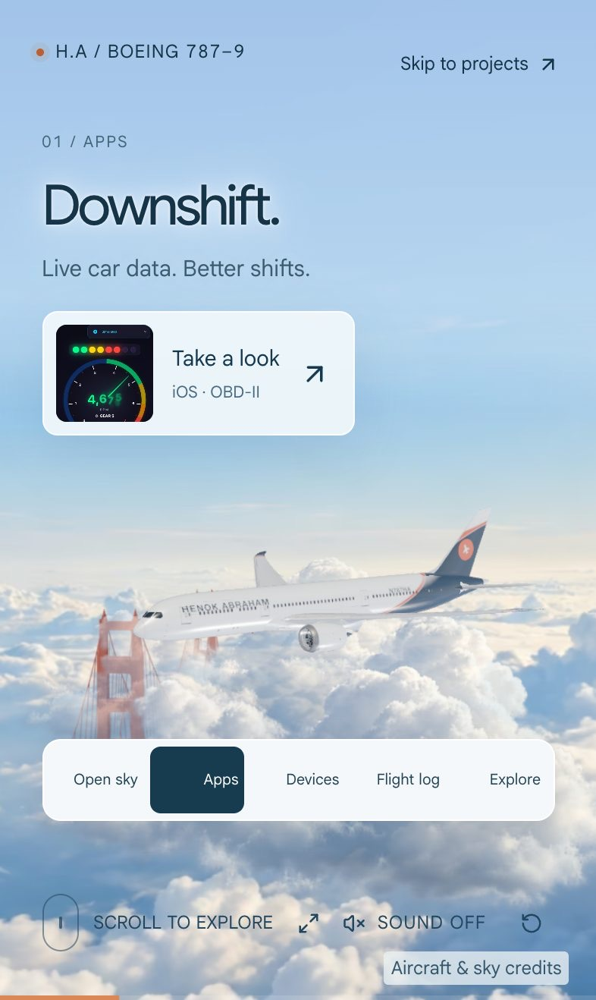

# Henok Abraham — Personal Airspace

My personal site: **[henokabraham.com](https://henokabraham.com)**. It opens with an airborne Boeing 787-9. The page begins with a moving blue sky; scrolling brings the aircraft past from behind the viewer into a look up one engine's tailpipe, its wing passing through the headline on the way (the near part of the wing in front of the letters, the far part behind them), then lets it fly on and away, wings flexed, banking gently into the distance. The flight reveals project previews and my flight log along the way, then leads into the full project board, route atlas, open-source work and contact form.

Native scrolling works with wheel, trackpad, touch and keyboard. Five chapter buttons follow the same camera path. Visitors can skip directly to projects, return to the open sky, or enable synthesized jet ambience. Reduced motion and WebGL/asset failure show a static sky with direct access to the portfolio. The initial sky does not run a WebGL render loop; drawing and sound suspend offscreen or in a hidden document.

|                                                                                          |                                                                                                  |
| ---------------------------------------------------------------------------------------- | ------------------------------------------------------------------------------------------------ |
|  |  |
|                        |                                        |

This is my own code and my own writing about it; it isn't a template or a tutorial project, so expect opinions baked into the implementation. See [License](#license) below for what you can and can't do with it.

## Airborne showcase

- `app/dreamliner-scene.tsx`: transparent Three.js renderer, HDR illumination, self-shadows, turning fans, wing flex, adaptive resolution and deterministic resource cleanup.
- `lib/dreamliner-tour.ts`: camera choreography and portrait framing. The original chapter IDs remain valid: `preflight` → Open sky, `roll` → Apps, `liftoff` → Devices, `bay` → Flight log, `cruise` → Explore. The choreography is a fly-by from astern, a hold on the port engine's exhaust and a departure that the chapter stops sample at increasing distance. The departure turns left to show the flexed wings from above and behind, then rolls out through its own track while the aim falls behind it, so the aircraft crosses the right of the frame at the last chapter and is gone by the end of the scroll — on a phone that also takes it clear of the Golden Gate, which stands near the middle of the portrait sky.
- `lib/dreamliner-cut.ts`: the wing through the headline. In the opening the caption text hangs at a fixed depth in front of the lens and sits under the renderer's canvas; the module rasterizes each glyph where the page draws it into a mask, and `addDepthCut` in `lib/airframe-flex.ts` has every opaque surface of the aircraft blend itself out where a glyph covers a fragment that lies beyond that depth, so the wing's near side covers the letters and its far side passes behind them, with the seam moving across the words as it sweeps by. The tour check asserts the visible wing covers part of the headline on every viewport.
- `app/scroll-departure.tsx` reveals Downshift, the iPhone–Wear OS bridge, the flight-log link and portfolio links across a 420svh native-scroll journey. Its first project appears at 18% progress. Optional project dialogs pause the renderer and clouds, then restore keyboard focus without moving the page. The earlier aircraft-only captions remain in `lib/dreamliner-annotations.ts` as an unused reference.
- `public/models/dreamliner-787-9.glb`: FlightGear 787-family exterior, 105,359 triangles in ten material groups, 4K fuselage and engine textures, Draco-compressed to 1,308,580 bytes (positions keep 16 bits, about a millimetre, because the livery and wing-flex shaders sample them in metres). `scripts/prepare-dreamliner.py` reproduces the plain model from a pinned upstream source and `scripts/compress-dreamliner.mjs` compresses it; the decoder is served beside it from `public/draco/`. Viewports narrower than 800 px fetch `dreamliner-787-9-phone.glb` instead: the same Draco mesh, byte for byte, under 2048² textures, 611,036 bytes, built by `scripts/prepare-dreamliner-phone.py`. The scene imports only the classes it uses through `lib/dreamliner-three.ts`, and `app/scroll-departure.tsx` loads it lazily, so the page's own script carries no three.js and a reduced-motion visit never fetches it. GPL-2.0 credits and the corresponding editable source are served at `/credits/dreamliner.html`.
- The Golden Gate stands above the fog at the lower left of the sky photograph, seen down its span so the near tower is large and the bridge recedes up the left edge, on the home page and the 404 page: `public/images/golden-gate.avif` (PNG fallback) is rendered from a bridge model of mine by `scripts/prepare-golden-gate.swift` (Model I/O export), `scripts/render-golden-gate.mjs` (three.js in headless Chromium, International Orange, the sky's light, plus a data pass of world height and camera distance per pixel) and `scripts/make-golden-gate-sprite.py` (per-pixel fog fade, haze thickening with distance). The source USDZ isn't in this repository — its own origin and licence are unknown to me, so I'm not redistributing it — only the rendered sprite is; supply your own bridge model under `archive/models/golden-gate-bridge.usdz` to reproduce the render step. `.bay-landmark` anchors it to the photograph in image fractions: the poster is a size container, so the sprite follows the photo's cover scaling on every aspect ratio and drifts with it. Portrait, which shows only the photo's middle third, switches to `golden-gate-portrait.avif`, rendered from just above the tower tops (`render-golden-gate.mjs --camera=1250,200,-130 --target=0,100,-40 --fov=20`); its eye level, which the render records, is pinned to the photo's horizon (`--landmark-anchor`), so both towers stand on the cloud deck and the span climbs up and to the right from the lower left, clear of the chapter bar.
- An Immersive control in the journey's bottom row asks the browser for fullscreen through the Fullscreen API where it exists (desktop, Android, iPad). WebKit has never let a page fill an iPhone's screen (WebKit bug 206854, still open against Safari 27), so on an iPhone the control opens a card explaining the one route that does, Add to Home Screen. It is hidden in a Home Screen launch, which has no browser bars to hide.
- On phones the page is edge to edge: `viewport-fit=cover` with the controls kept inside the safe areas, the journey's sticky frame sized to the large viewport so the sky and the aircraft fill the screen once Safari's bars collapse (the chapter bar stays anchored to the small viewport), no overscroll bounce, and `site.webmanifest` plus the Apple web-app tags so Add to Home Screen opens the site without browser chrome behind a translucent status bar. Safari 26 ignores `theme-color` and tints its glass bars from the background colour of the fixed or sticky element at each screen edge, falling back to its own grey, so the journey's sticky frame carries the sky colour under the poster.
- The opening sky and its cloud sprite are served as AVIF (57 KB and 40 KB) through `image-set()`, with the original JPEG and PNG as the plain `background` a browser without AVIF keeps; the Worker's Early Hint preloads the AVIF with its type so such a browser skips it. `app/not-found.tsx` puts the same sky behind a 404 page with links to the tour, the projects and the flight log.
- The old SFO/Bay scenery is retained as a previous experiment, but its modules and terrain preloads are absent from the active tour. Current rendering resources are spent on the aircraft. `scripts/scene-assets.mjs` versions and deploys only the five files the tour fetches; the retired tiles and scenery live under `archive/`, outside the public tree, for the experiment's scripts and checks, so a build never copies or lists them. The aircraft and its lighting are fetched by the scene once it decides to run, so reduced-motion visitors and browsers asking to save data download neither, and the lighting map never delays the aircraft.

## Develop

```sh
npm install
npm run dev
```

## Validate and build

```sh
npx tsc --noEmit -p .
npx oxlint app lib scripts
node scripts/check-dreamliner-tour.mjs
node scripts/check-dreamliner-lifecycle.mjs
node scripts/check-personal-flight-log.mjs
node scripts/check-bay-performance.mjs
node scripts/check-bay-flight.mjs
node scripts/check-bay-scenery.mjs
node scripts/check-bay-rendering.mjs
npm run build
```

`npx oxlint` passes for the whole repository: the starter kit is down to the dialog and button the project modal uses, and the vendored Draco decoder under `public/draco/` is excluded. `.github/workflows/checks.yml` runs this same list, every `scripts/check-*.mjs` and the Cloudflare build on each push and pull request; deploys stay local. The scene checks run offline and never fetch or modify tile imagery; `check-scheduled.mjs` runs the built Worker's cron in Miniflare against canned weather, GitHub and reachability upstreams, and `node scripts/check-scheduled.mjs --live` exercises the real feeds instead.

## Earlier Bay terrain experiment

The following notes document the preserved terrain implementation; it is no longer mounted by the home page.

`app/scroll-departure.tsx` maps native scroll to chapter progress. `lib/bay-flight.ts` defines a continuous Hermite flight path in meters and its camera shots. `app/bay-flight-scene.tsx` loads the aircraft, terrain and HDR illumination, and renders a floating-origin scene with animated gear and fans. `app/bay-departure.css` controls the sticky journey and responsive composition. `lib/bay-audio.ts` creates optional ambience only inside a user gesture.

Portfolio content lives in `app/flight-data.ts` and `app/terminal-experience.tsx`. The featured Departure over the Bay briefing records the fixed-path scheduling decision, the 1,671-tile / 16,150,728-byte shipped budget, atlas memory and the 15-of-16 terrain sampler budget. These are asset/allocation figures, not invented performance or per-visit transfer measurements. Pointer depth on project cards is handled by `app/use-airspace-depth.ts`. General typography and the portfolio sections are in `app/globals.css`.

Sources, licenses, asset sizes and scenery approximations are documented in [ASSETS.md](ASSETS.md) and linked from Scene credits on the website. The terrain data preparation script accepts a directory containing the credited source tiles and registration JSON. Production assets are already included; no runtime mapping service, API key or external asset request is needed.

The realism pass adds public-domain NAIP detail around SFO, real OpenStreetMap terminal/hangar footprints batched into roof/wall surfaces, photographed asphalt color/normal/roughness maps, land/water-aware shading, clearcoat aircraft paint, lower telephoto departure shots, matching wing/shadow flex, and mechanically folding gear. `lib/bay-surface.ts`, `lib/sfo-buildings.ts`, and `lib/airframe-flex.ts` contain those additions. The scenery checks validate source registration, all generated building geometry, and shader patch integration; camera checks validate framing across portrait and wide viewports. Browser visual QA is separate.

The open-source rendering pass adds Takram's physically computed atmosphere, N8AO contact shadows and a half-float HDR composition pipeline with subtle bloom and AgX. `lib/bay-rendering.ts` owns the passes and resource lifecycle; `lib/bay-atmosphere.ts` anchors the atmosphere to the floating SFO scene. The scene is lit from the same scattering tables: the sun colour is sampled from the transmittance table and image-based light comes from a sky cubemap rendered around the aircraft, so sky, haze and lit surfaces share one exposure. Terrain now uses a 1025² elevation grid from zoom-12 tiles under stacked public-domain NAIP imagery (0.63 m around the runway, 3.9 m along the SFO–Marin corridor), with near-field ground grain, procedural runway wear, building glazing bands and procedural aircraft skin detail. The whole corridor from the airport to the Golden Gate carries 229,536 extruded building footprints, San Francisco's from the city's LiDAR survey and the peninsula's from OpenStreetMap, with roofs draped in the same imagery (`lib/bay-city.ts`, `scripts/prepare-city-buildings.py`), under baked building shadows and sky visibility (`scripts/prepare-bay-shadows.py`), drifting cloud shadows, some 310,000 instanced tree canopies classified from the imagery (`lib/bay-trees.ts`), an analytic livery on the aircraft (`lib/bay-livery.ts`), heat haze behind the engines and vapour off the wingtips at rotation (`lib/bay-thrust.ts`), ground imagery around the airport and the climb-out streamed as tiles scheduled along the fixed camera path (`lib/bay-tiles.ts`, `scripts/prepare-bay-tiles.py`), a sharper corridor layer and moving freeway traffic under the climb-out (`lib/bay-traffic.ts`, `scripts/prepare-bay-traffic.py`), a procedural Golden Gate Bridge placed from OpenStreetMap (`lib/bay-bridge.ts`), SFO's approach-light piers, field lighting, signs, markings and a parked fleet placed from OpenStreetMap's airfield layout (`lib/sfo-airfield.ts`), and a few easter eggs (`lib/bay-easter-eggs.ts`: click the aircraft, the Konami code, `gt350`, `karl`). The flight is rate-limited so fast scrolling cannot strobe the scenery, and heavier variants wait for a short frame-time measurement. [RENDERING.md](RENDERING.md) records the Three.js/Cesium/3D Tiles comparison, mobile settings, fallback behavior and validation limits.

## Deploy

The build targets Cloudflare Workers: `dist/server` holds the Worker and `dist/client` the static assets, and the generated `dist/server/wrangler.json` names the Worker `henokabraham-com` (set in `vite.config.ts`). The HTML document, live-data APIs, contact handler and anonymous measurement endpoint run in the Worker; static assets use Cloudflare’s asset service.

```sh
npm run check:cloudflare
npm run deploy:cloudflare
```

`npm start` serves the same build locally in workerd. JavaScript and CSS under `/_next/static/` and versioned scenery under `/scene/<content-hash>/` use immutable browser caching. The build computes that version from the names and bytes of the four tour files; changes produce new URLs. Plain `/models/`, `/scenery/` and `/tiles/` paths are no longer deployed. The document carries HSTS, `nosniff`, a frame-ancestors policy and a referrer policy from `worker.ts`; static files get `nosniff` from `public/_headers`.

Retain the existing Sites project ID in `.openai/hosting.json` when publishing there. `vite.config.ts` retains the direct Cloudflare custom domain for `henokabraham.com`.

## Shared chapters and aviation notes

Project selection and scroll chapters use replace-only query parameters, for example `/?project=flight-tracker&chapter=bay`. Project IDs come from `flight-data.ts`; chapters are `preflight`, `roll`, `liftoff`, `bay`, and `cruise`. `lib/flight-links.ts` validates incoming values, preserves unrelated parameters and history state, and does not add history entries. The chapter seeds the progress ref and scroll position before the scene mounts. Invalid values use the default selection/current scroll. Reduced motion keeps its static sky view. Section anchors still work for native navigation; a valid shared chapter takes precedence on initial restoration. Changes to project/chapter remove redundant `#flight`/`#departures` anchors.

In the earlier terrain experiment, `lib/bay-annotations.ts` schedules six sparse DOM annotations from scroll progress: brake release, rotation, gear retraction, wing flex, San Bruno Mountain and the Golden Gate. Each is labelled as cinematic scene data rather than real flight data. They appear only with a ready scene and are hidden at widths of 1100 px or less, heights of 700 px or less, and for reduced motion. Rapid scrolling can put these scroll-scheduled notes ahead of the rate-limited aircraft; inspect their timing in visual QA.

`scripts/data/personal-flights.ts` is an import source used only during summary generation. It contains 370 of my own historical Flighty records spanning December 2016–September 2026: 42 airports, 13 countries/regions and 325,585 estimated airport-to-airport miles. Three canceled flights are excluded. All four diversions retain the scheduled airport and use the actual destination on the map; the return-to-origin record contributes one flight but no estimated route miles. One historical noncanceled record lacks actual timing data and is retained as logged, without inventing times. The old site-reference notes remain in `app/aviation-logbook-data.ts` but are no longer displayed as a flight log.

Each verified record uses the `PersonalFlight` type from `lib/personal-flight-log.ts`: a stable ID, a date (or `null`), origin/destination airport codes, names, country labels, latitude/longitude, and optional airline, flight number, aircraft and `scheduledTo` for a diversion. Airport records can include `city` for compact display. Keep booking references, seats, and other private fields out. Do not infer personal trips from project names or the site's SFO reference.

The atlas shows only the map, summary totals and an overlapping row of circular country flags, ordered by first visit within the selected period. Year filters update every summary; selecting a flag highlights that country’s routes. International airport labels include local SVG flags. Individual flights, dates, flight numbers and boarding passes are absent from the UI and runtime data. `scripts/build-flight-atlas.mjs` generates `app/flight-atlas.ts` with only totals, airport metadata and deduplicated routes for each year and all time; both build commands refresh it automatically. Route miles are estimates between airport coordinates, not actual track miles. Repeated trips count separately in totals and share a map arc; date-line crossings split into separate segments. The 49 KB world map is local Natural Earth public-domain land data, credited in `public/credits/flight-log-map.txt`. A compact, spaced row of transparent logos below the country flags shows all 14 airlines, ranked by flight count within the selected period. The row has no tile backgrounds and retains each airline’s representative colors; American uses blue, silver and red, and Spirit uses yellow. Dark blue marks receive a modest brightness lift for legibility. Tapping a logo reveals its name and aggregate count. Logo files are hosted locally and credited in `public/credits/airline-logos.txt`. The summary map is static, with country highlights on demand; hover motion respects reduced motion. The regression checks use synthetic geometry fixtures that never enter the public dataset.

## Deploy to your Cloudflare account

Copy `.env.example` to `.env.cloudflare.local` and fill it in. See [CLOUDFLARE.md](CLOUDFLARE.md) for the scoped token, account ID, local dry run and direct deployment commands.

### Refresh the Flighty import

```sh
python3 scripts/import-flighty.py /path/to/FlightyExport.csv --before 2026-09-13
npx oxfmt scripts/data/personal-flights.ts
node scripts/build-flight-atlas.mjs
python3 scripts/check-flighty-import.py
node scripts/check-personal-flight-log.mjs
node scripts/check-flight-log-view.mjs
# After a production build, also verify no individual flights are shipped:
node scripts/check-flight-log-view.mjs --built
```

The cutoff is exclusive: flights on that day or later are omitted. Use an explicit date when refreshing. The importer reconciles all source rows, excludes cancellations, skips exact duplicate flights and writes only allowlisted public fields. The private CSV stays outside the repo and matching filenames are ignored by Git. Airport lookup data is checked in at `scripts/data/flight-log-airports.json`; unknown airports or airline codes require an explicit lookup update. Public source credits are in `public/credits/flight-log-data.txt`.

## License

My own code is [MIT-licensed](LICENSE). Everything under `public/` and `archive/` that I didn't make myself keeps its original licence instead — the FlightGear 787 exterior is GPL-2.0, OpenStreetMap and NAIP/DataSF layers are ODbL or public domain, Poly Haven HDRIs and textures are CC0, and so on. [ASSETS.md](ASSETS.md) and `public/credits/` name the source and licence for every one of those files; when in doubt about a specific asset, that's where to look before reusing it.
